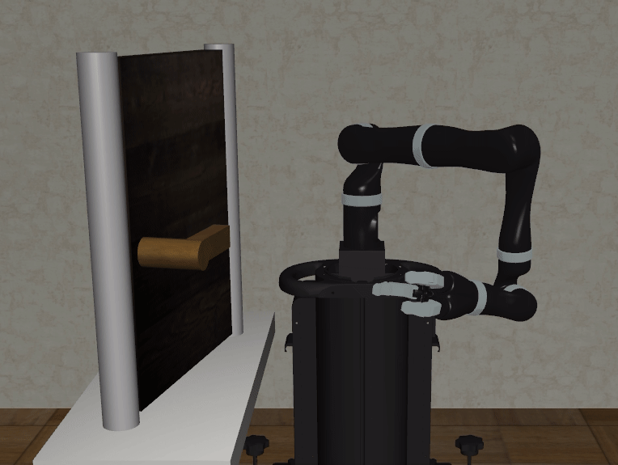

# seqopt

An approach to Hierarchical and Explainable Reinforcement Learning using Reward Decomposition and Options-based Learning for sequentially composable subtasks.

 

## Installation

The following instructions have been validated on Ubuntu 18.04 only.

1. Install MuJoCo (if not already installed). See [Mujoco Installation](#mujoco-installation)
5. Clone this repository

        git clone https://github.com/SomeshDaga/seqopt.git

6. Install Python 3.6 and Virtualenv

         sudo apt install python3.6
         sudo apt install python3-venv

7. Initialize a Python 3.6 Virtual Environment

         cd seqopt
         virtualenv -p /usr/bin/python3.6 .

8. Activate the virtual environment

         source bin/activate

9. Install python dependencies

         pip install -r requirements.txt

### MuJoCo Installation

1. Download [MuJoCo](https://www.roboti.us/download/mujoco200_linux.zip)
2. Unzip and install

         unzip mujoco200_linux.zip
         mkdir -p ~/.mujoco
         mv mujoco200_linux ~/.mujoco/mujoco200

3. Obtain a [MuJoCo license](https://www.roboti.us/license.html). Install the license `mjkey.txt` to `~/.mujoco`

## Implemented Features

### Simulation Environments

Since our method requires expert-defined aspects for any training environments, current implementation
only supports

1. A custom variation of the `manipulator` domain and `bring_ball` task from the [DeepMind Control Suite](https://github.com/deepmind/dm_control)
2. A custom variation of the `door` task with the `Jaco` manipulator from [robosuite](https://github.com/ARISE-Initiative/robosuite)

Our custom variations do not change the environment dynamics in any way, but rather introduce changes to things like initialization conditions, hand-crafted features etc.

Support for additional environments may be added by defining configuration files for newly added tasks such as those
for the `door` and `manipulator`tasks in `seqopt/scripts/door` and `seqopt/scripts/manipulator` respectively.

### Algorithms

An Options-Based Soft-Actor Critic algorithm is implemented for learning. A single option may be specified for the task (through the configuration files) to allow for benchmarking using a conventional (i.e. not options-based) SAC agent.

*Note:* A PPO-based implementation was also attempted but presented with poor learning across the task, and hence wasn't pursued further

## Usage

Run all scripts from the root of the repository

### Training

Execute `seqopt/scripts/train.py` with desired arguments/flags

         usage: train.py [-h] [--option-critic] [--continue-training CONTINUE_TRAINING]
                [--eval-log-name EVAL_LOG_NAME] [--verbose]
                {ppo,sac}
                {door,door_benchmark,manipulator,manipulator_benchmark}

Example usage:

         python -m seqopt.scripts.train sac door --eval-log-name experiment_1 --verbose

#### Arguments

Required (or Positional Arguments):
- **Algorithm:** `ppo` or `sac` (Best to avoid `ppo` as it may have bugs)
- **Environment**: For each environment, we define an options-based and a benchmark configuration e.g. `door` and `door_benchmark`. Use the `*_benchmark` environment for a conventional SAC agent configuration

Optional:

- **--continue-training**: Specify path to a checkpoint model zip file to resume training from
- **--eval-log-name**: Specify a folder name to enable checkpoint and tensorboard logging
- **--option-critic**: Use flag to enable the `Option-Critic` execution model. Otherwise, defaults to the `Option Chain` model
- **--verbose**: Use flag to enable logging training updates to terminal

### Evaluation

Execute `seqopt/scripts/evaluate.py` with desired arguments/flags

         usage: evaluate.py [-h] [--stochastic-actions] [--stochastic-terminations]
                   [--n-eval-episodes N_EVAL_EPISODES] [--seed SEED]
                   [--no-render] [--device {cpu,cuda,auto}]
                   {ppo,sac}
                   {door,door_benchmark,manipulator,manipulator_benchmark}
                   model

Example usage:

         python -m seqopt.scripts.evaluate sac door experiments/door/seqsac/option_critic.zip --stochastic-terminations --n-eval-episodes 5 --device cpu

**Note:** Please use the `--device cpu` flag on all runs (minor bugs with cuda implementation may exist)
## Trained Models

Obtain fully-trained models (for supported environments) under the `Options Chain` and `Option-Critic` models, and a conventional SAC agent at this [link](https://drive.google.com/drive/folders/1c4Gtd8p6uJdKv6cFYrXGLYXzrl5lUTZh?usp=sharing).

**More documentation to come soon...**
